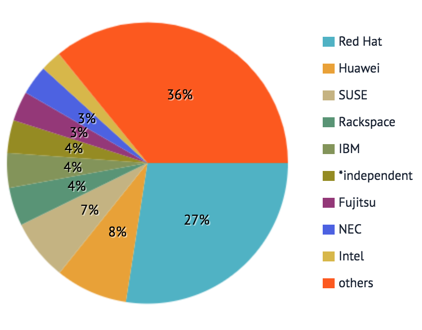
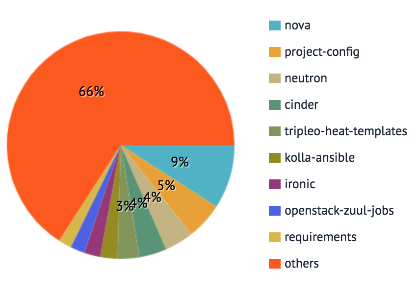
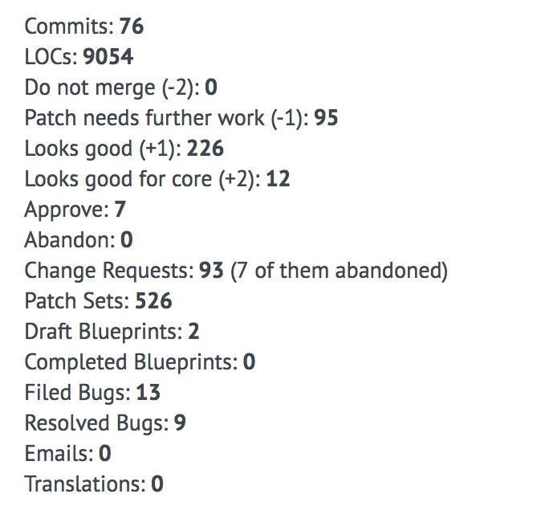
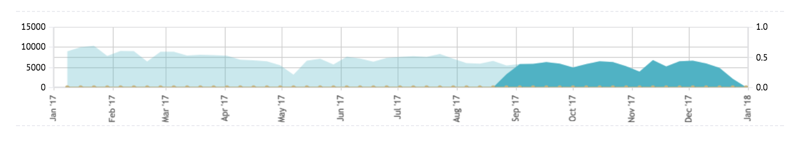

## Production Site: [Stackalytics](http://stackalytics.com/)

The Stackalytics (OpenStack Analytics) site was developed my the Mirantis corporation in 2013 to provide OpenStack with an analytics tool that collects code contributions data, vendor drivers information, and a community members directory. As [defined by Mirantis](https://www.mirantis.com/blog/stackalytics-com-whos-growing-the-openstack-pie/), _"Stackalytics is a data visualization tool that collects data from GitHub and presents it in an array of useful forms."_

### Metrics

From the Stackalytics site, a number of key metrics are collected from the code contributions made by the OpenStack community. They include:

* Commits
* Completed Blueprints
* Drafted Blueprints
* Emails
* Filed Bugs
* Lines of Code
* Patch Sets
* Person-day effort
* Resolved Bugs
* Reviews
* Translations

#### Commits
Commits are defined as the number of code contributions that have been committed to an Openstack project/repo.

#### Completed Blueprints
Completed Blueprints indicates the number of blueprints that have been completed and is counted as the person who made an effort to deliver the blueprint into the upstream codebase.

#### Drafted Blueprints
Drafted Blueprints indicates the number all blueprints contributed to in OpenStack LaunchPad, and lists the original author of each blueprint.

#### Emails
Emails (as a metric) indicate the number of emails sent/replied to OpenStack mailing lists.

#### Filed Bugs
Filed Bugs indicate the number of bugs filed on [Openstack LaunchPad](https://bugs.launchpad.net/openstack).

#### Lines of Code
Lines of Code are

#### Patch Sets
Patch Sets are

#### Person-day effort
Person-day effort is metric determined by

#### Resolved Bugs
Resolved Bugs are

#### Reviews
Reviews are defined as

#### Translations
Translations are defined as

### Contribution Filters

The data provided by each of these metrics can be filtered in a number of ways. They are as follows:

* Release
* Project Type
* Module
* Company
* Contributor

#### Release
The **Release** filter allows the metrics to be filtered by the official OpenStack releases. At the time of this writing, the current releases available to be filtered by are:
  * Austin
  * Bexar
  * Cactus
  * Diablo
  * Essex
  * Folsom
  * Grizzly
  * Havana
  * Icehouse
  * Juno
  * Kilo
  * Liberty
  * Mitaka
  * Newton
  * Ocata
  * Pike
  * Queens

#### Project Type
The **Project Type** filter allows the contribution metrics to be filtered by project type. At the time of this writing, there are two parent-project types:

  * **OpenStack** projects are projects that are defined by the OpenStack Governance committee, which include two project subtypes:
    * Official
    * TC-approved
    * Others - projects that are **not** included in any OpenStack program.

  * **Complimentary** indicates projects that are part of the OpenStack ecosystem, which includes 9 project subtypes:
    * Ansible
    * Ceph
    * Cloud Foundry
    * Docker
    * Kubernetes
    * OPNFV
    * OpenShift
    * Open vSwitch
    * Python Packaging

#### Module
The **Module** filter allows the contribution metrics to be filtered by repositories, official projects, or pre-configured groups of modules.  This list of modules is quite large, but some of them include:
  * Barbican Official
  * Blazar Official
  * Ceilometer Official
  * Chef Openstack Official
  * Cinder Official
  * Cloudkitty Official
  * Congress Official
  * Cyborg Official
  * Designate Official
  * Documentation Official
  * Glance Official
  * Heat Official
  * Horizon Official
  * I18N Official
  * Infrastructure
  * anchor
  * ansible-hardening
  * ansible-role-k8s-cookiecutter
  * bifrost
  * bindep
  * ciwatch

#### Company
The **Company** filter allows the contribution metrics to be filtered by contributors based on their company affiliation.

#### Contributor
The **Contributor** filter allows the contribution metrics to be filtered by the name of the contributor as configured in Launchpad.

The **Contributor** page shows an individual contributor's metrics. Example: [Eric Fried](http://stackalytics.com/?metric=commits&company=ibm&user_id=efried)

From the contributor page, the following metrics are available:
  * Name - The full name of the contributor
  * Company - The company affiliation of the contributor
  * LaunchPad - The LaunchPad account ID of the contributor
  * Gerrit - The Openstack Gerrit ID of the contributor
  * Core in - Indicates which OpenStack projects the contributor has core review permissions
  * Activity Log - Displays the contributor's most recent Activity
  * Contributions by Module - A pie-graph indicating which Openstack modules have been contributed to
  * Commits by Module - Indicates the number of commits per Openstack module
  * Contribution Summary - Captures the following commit metrics:
    * Commits
    * LOCs
    * Do not merge
    * Patch needs further work
    * Looks good
    * Looks good for core
    * Approve
    * Abandon
    * Change Requests
    * Patch Sets
    * Draft Blueprints
    * Completed Blueprints
    * Filed Bugs
    * Resolved Bugs
    * Emails
    * Translations

### Data Visualization Examples

#### Contributions by Companies

#### Contributions by Modules

#### Contributions Summary

#### Reviews by Year (2017)

