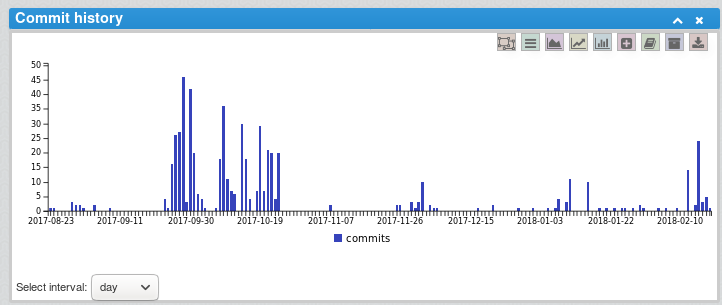
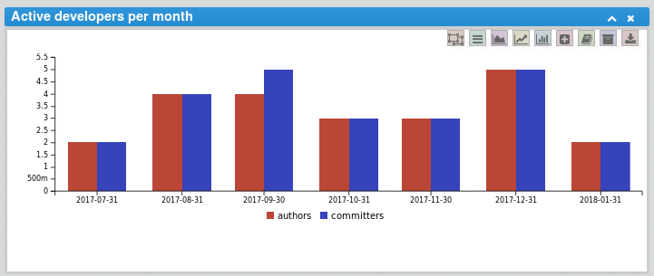
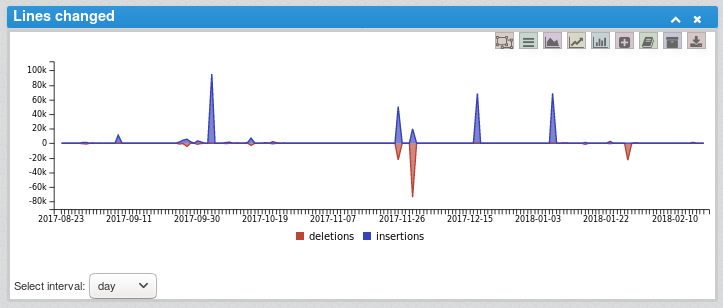
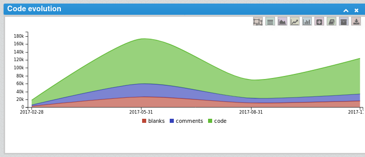
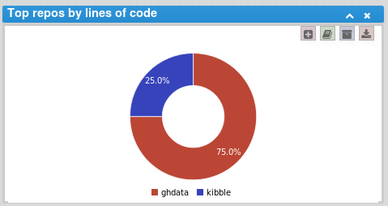
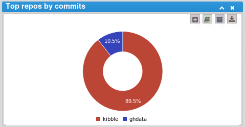
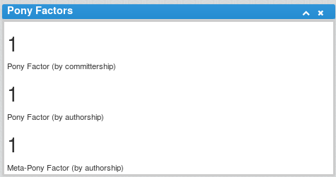
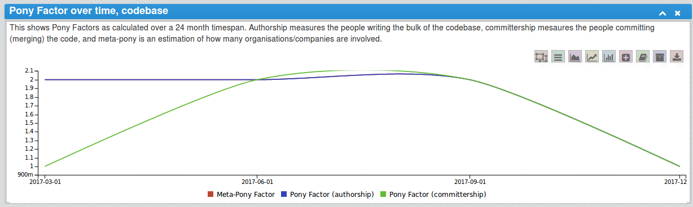

## Production Site: [Apache Kibble](https://kibble.apache.org/)

Apache Kibble is a suite of tools for collecting, aggregating and visualizing activity in software projects. 

### Metrics

From the Kibble UI, a number of key metrics are collected. They include:
* Commit Authors
* Number of commits
* Number of lines changed
* Number of committers 
* Percent of each of programming language
* Percent of code
* Percent of comments
* Percent of blanks
* Top 5 contributors
* Number of commits by an author
* Number of deletions by an author
* Number of insertions by an author
* Commit History
* Active Developers Per Month
* Lines Changed
* Code Evolution
* Top Repos by Lines of Code
* Top Repos by Commits
* Pony Factor

#### Commit Authors
The commit authors indicate the amount of users who committed to the project. A percentage is provided to show an increase or decrease for the number authors based on previous data. 

#### Number of commits
The number of commits indicate the amount of commits to the project. A percentage is provided to show an increase or decrease for the number commits based on previous data. 

#### Number of lines changed
The number of lines changed indicate the amount of lines changed in the project. A percentage is provided to show an increase or decrease for the number of lines changed based on previous data. 

#### Number of committers 
The number of committers indicate the amount of people who committed to the project. A percentage is provided to show an increase or decrease for the number committers based on previous data. 

#### Percent of each programming language
The percent of each programming language indicates the prevelance of each programming language in project. 

#### Percent of code
The percent of code indicates the prevelance of code in the project when compared to the percent of comments and blanks. 

#### Percent of comments
The percent of comments indicates the prevelance of comments in the project when compared to the percent of code and blanks. 

#### Percent of blanks
The percent of blanks indicates the prevelance of blanks in the project when compared to the percent of code and comments. 

#### Top 5 contributors
The top 5 contributors displays the top 5 contributors to the project. 

#### Number of commits by an author
The number of commits by an author indicates how many times an author has committed to the project. Currently information on only the top 5 authors is available. 

#### Number of deletions by an author
The number of deletions by an author indicates how many times an author has made deletions to the project. Currently information on only the top 5 authors is available. 

#### Number of insertions by an author
The number of insertions by an author indicates how many times an author has inserted to the project. Currently information on only the top 5 authors is available. 

#### Filters
Metrics may be evaluated by date or repository source. 

#### Commit History
Commit History shows how many commits have been made to the repositories over a specified time period.

#### Active Developers Per Month
Compares the amount of commiters and authors that were active each month.

#### Lines Changed
Lines Changed compares the number of insertions and deletions made to the repositories each day.

#### Code Evolution
Code Evolution shows the number of code, comment, and blank lines in the code each month.

#### Top Repos by Lines of Code
This metric shows which repositories have the most lines of codes.

#### Top Repos by Commits
This metric shows which repositories have the most commits

#### Pony Factor
Pony factor is “the lowest number of committers whose total contribution constitutes the majority of the codebase.” 
A more in depth explanation of this metric can be found here: https://ke4qqq.wordpress.com/2015/02/08/pony-factor-math/

### Data Visualization Examples
#### Commit Trends

#### Language breakdown by programming language

#### Commit Language breakdown 

#### Top 5 contributors

#### Relationships 

#### Commit History

#### Active Developers Per Month

#### Lines Changed

#### Code Evolution

#### Top Repos by Lines of Code

#### Top Repos by Commits

#### Pony Factor

