## Software: [gitstats](http://gitstats.sourceforge.net/)
`gitstats` is a statistics generator for git repositories. It examines the repository and produces statistics based on its history. Currently it produces only HTML output with tables and graphs.

`gitstats` is written in Python. The source code can be cloned from https://github.com/hoxu/gitstats. It also has packages for Fedora, Debian, and MacOS.

Both the code and the web site are licensed under GPLv2/GPLv3.

```
$ gitstats --help

Usage: gitstats [options] <gitpath..> <outputpath>

Options:
-c key=value     Override configuration value

Default config values:
{'project_name': '', 'processes': 8, 'max_domains': 10, 'commit_begin': '', 'max_ext_length': 10, 'commit_end': 'HEAD', 'linear_linestats': 1, 'style': 'gitstats.css', 'max_authors': 20, 'authors_top': 5, 'start_date': ''}

Please see the manual page for more details.
```

### Metrics
`gitstats` separates its metrics in the following categories:
  * General
  * Activity
  * Authors
  * Files
  * Lines
  * Tags

#### General
The general metrics that are produced by `gitstats` provide an overview of a project. These metrics are:
  * **Project Name** - the name of the project.
  * **Generated Date** - when the HTML output was generated.
  * **Generator** - the version of `gitstats` that was used to generate the metrics.
  * **Report Period** - the timeframe for which the report was generated.
  * **Age** - the age of the project (in days) and how many days have been active.
  * **Total Files** - the number of files in the project.
  * **Total Lines of Code** - the number of lines of code (number of lines added - number of lines removed).
  * **Total Commits** - the number of commits, including an average number of commits per active day and an average number of commits per lifetime of the project.
  * **Authors** - the number of authors, including an average number of commits per author.

#### Activity
  * **Weekly Activity** - the number of commits per week for the last 32 weeks.
  * **Hour of Day** - a heatmap showing the hour of the day when most activity takes place, in addition to a bar chart showing how many commits were made in a given hour.
  * **Day of Week** -  a bar chart showing the number of commits that occurred on a given day of the week.
  * **Hour of Week** - a heatmap showing the hour of the week when most activity takes place.
  * **Month of Year** - a bar chart showing the number of commits for a given month.
  * **Commits by Year/Month** - a bar chart showing the number of commits for a year/month over the lifetime of the project.
  * **Commits by Year** - a bar chart showing the number of commits for a year over the lifetime of the project.
  * **Commits by Timezone** - a heatmap showing the timezone when most activity takes place.

#### Authors
  * **List of Authors** - For the top _n_ (based on argument passed) authors, the following details are provided:
    * Author Name
    * Commit %
    * \+ Lines
    * \- Lines
    * First Commit
    * Last Commit
    * Age
    * Active Days
    * Rank by Commits
  * **Cumulated Added Lines of Code per Committer** - For top _n_ (based on argument passed) authors, provides a graph of the added lines of code over time.
  * **Commits per Author** - For top _n_ (based on argument passed) authors, provides a graph of their commits over time.
  * **Author of the Month** - For each month/year of the project, shows the author who contributed the most, including the percentage of commits and total number of authors for the month/year.
  * **Author of the Year** - For each year of the project, shows the author who contributed the most, including the percentage of commits and total number of authors for the year.
  * **Commits by Domain** - For top _m_ (based on argument passed) email domains, provides a graph showing the number of commits for particular email domain.

#### Files
  * **Total Files** - the total number of files in the project.
  * **Total Lines** - the total number of lines in the project.
  * **Average File Size** - the average number of lines in a file within the project `(total lines / total files)`.
  * **File Count by Date** - a bar chart showing the file count by date.
  * **Extensions** - a list of all file extensions that exist within the project, including the percentage of files with that extension, the percentage of lines with that extension, and the average lines per file with that extension.

#### Lines
  * **Total Lines** - the total number of lines in the project.
  * **Lines of Code** - a graph showing the lines of code over the lifetime of the project.

#### Tags
  * **Total Tags** - the total number of tags in the project.
  * **Average Commits per Tag** - the average number of commits per tag.
  * **List of Tags** - a list of tags, the date the tag was created, the number of commits for the tag, and the authors who made commits against that tag.

### Data Visualization Examples

#### General


#### Activity
##### Weekly Activity

##### Hour of Day

##### Day of Week

##### Hour of Week

##### Month of Year

##### Commits by Year/Month

##### Commits by Year

##### Commits by Timezone


#### Authors
##### List of Authors
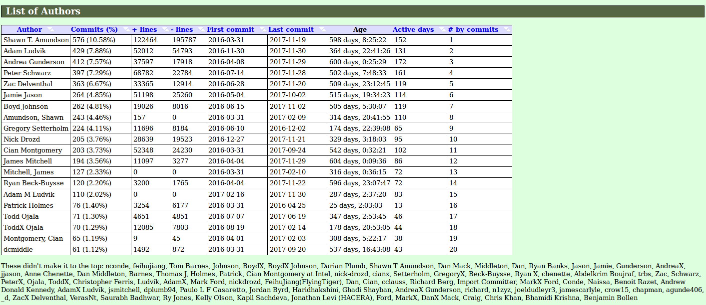
##### Cumulated Added Lines of Code per Committer
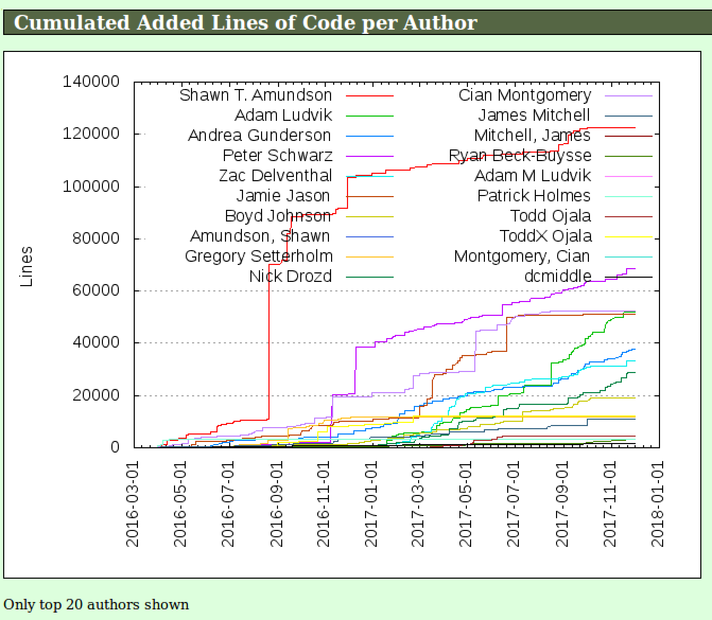
##### Commits per Author
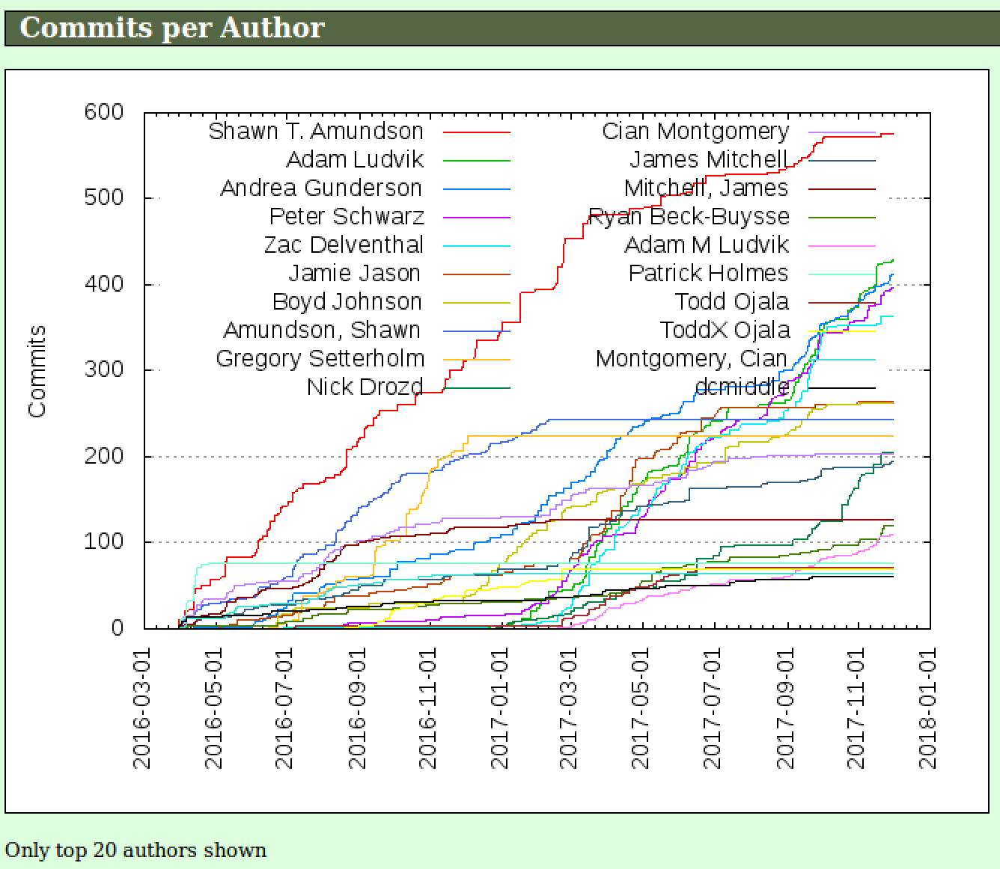
##### Author of the Month
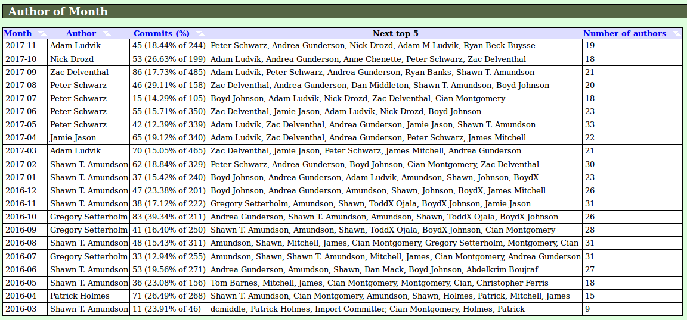
##### Author of the Year
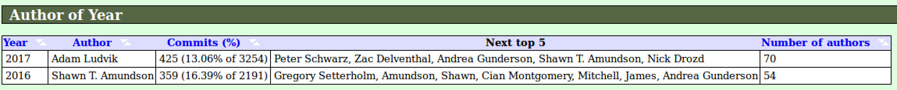
##### Commits by Domain
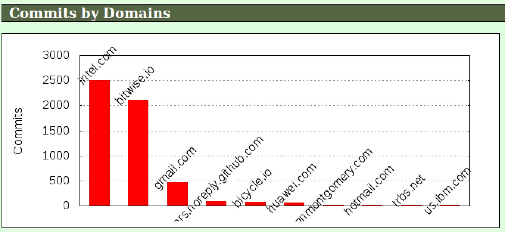

#### Files
##### Files Overview
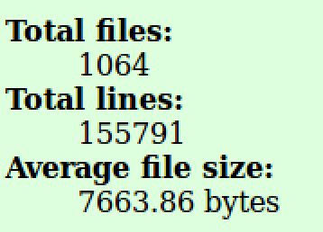
##### File Count by Date
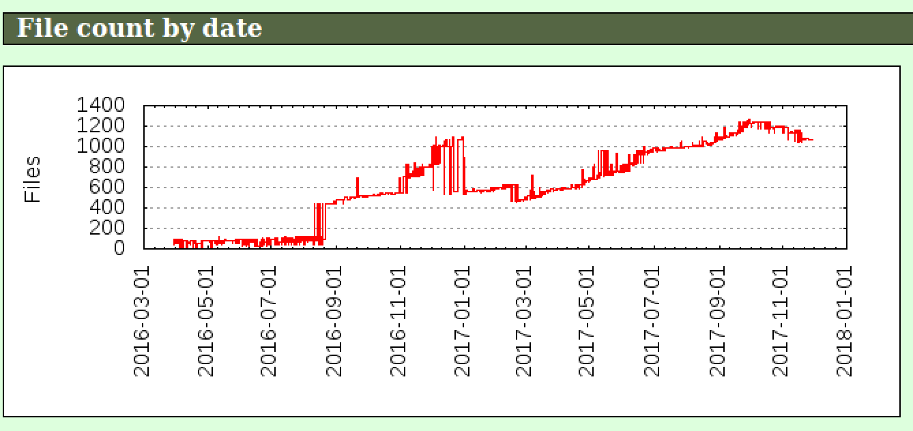
##### Extensions
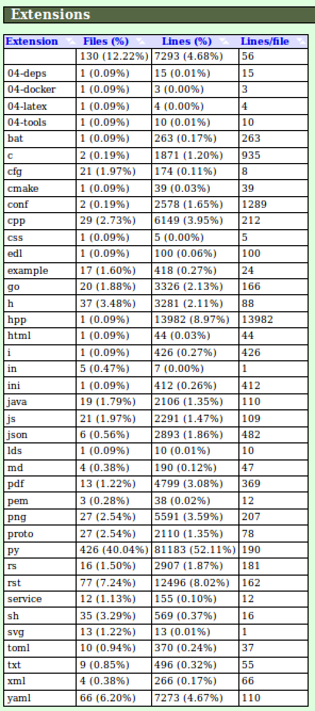

#### Lines
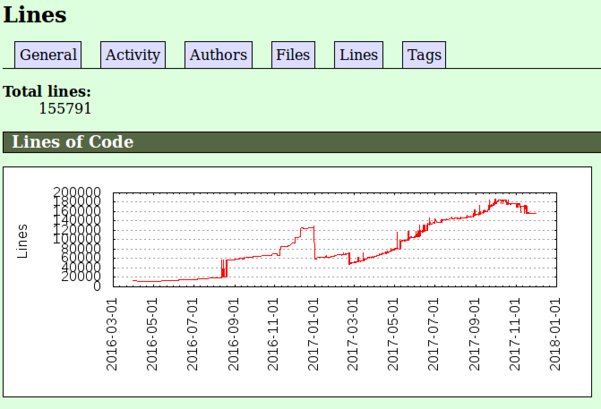

#### Tags
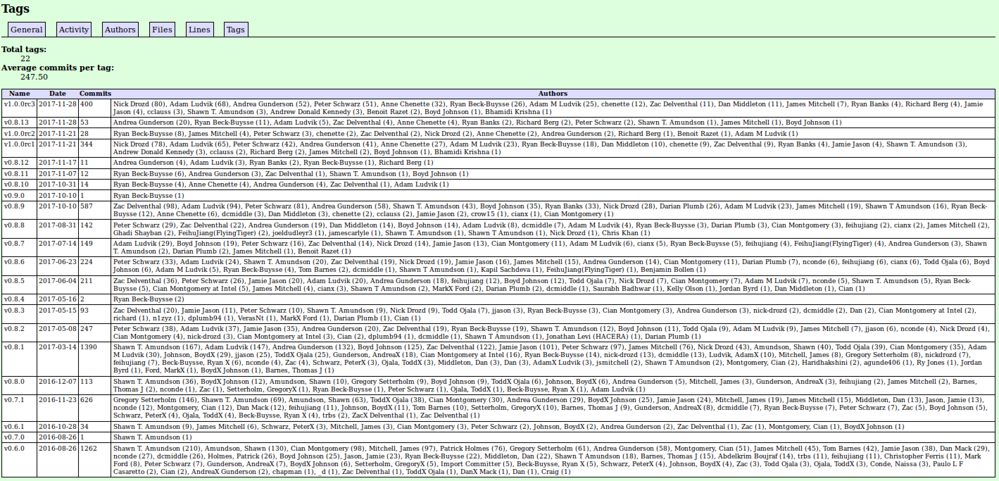
