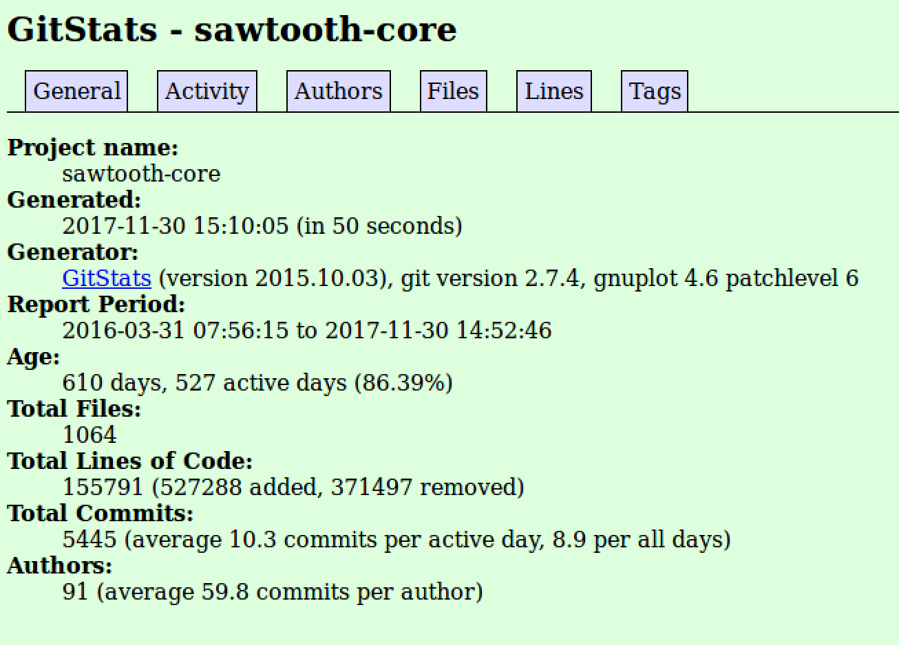
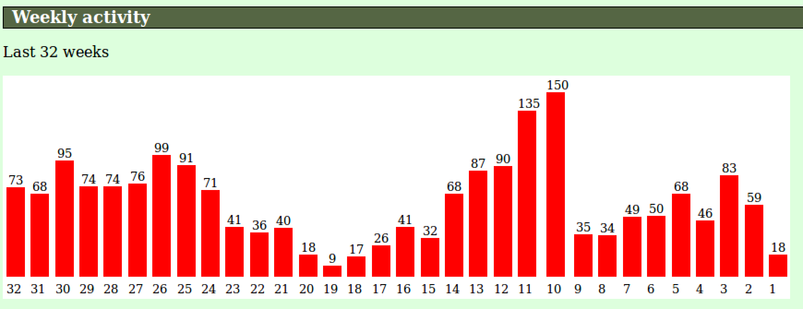
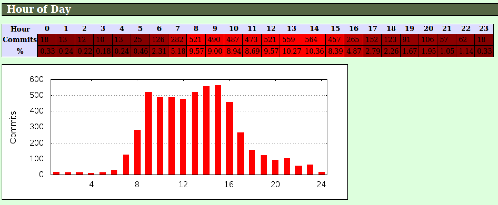
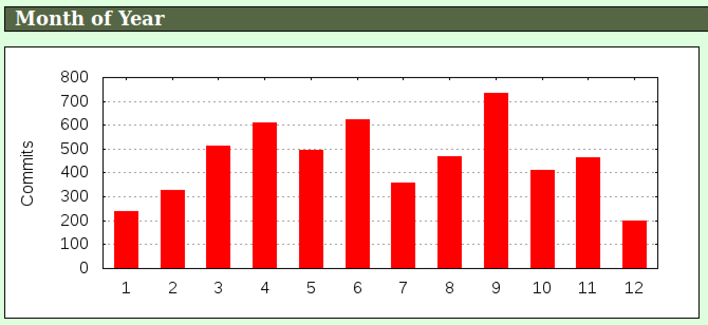
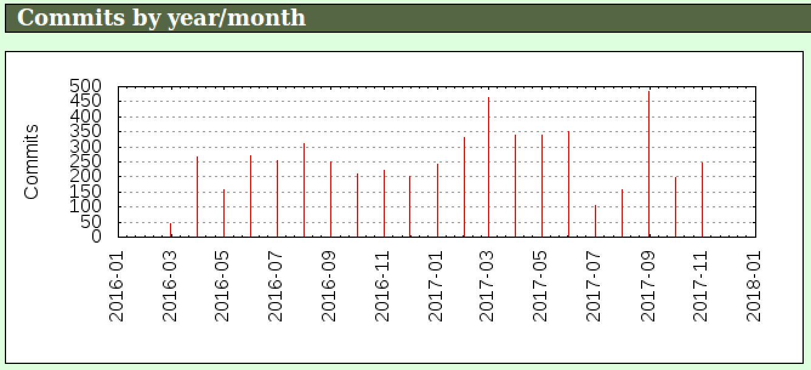
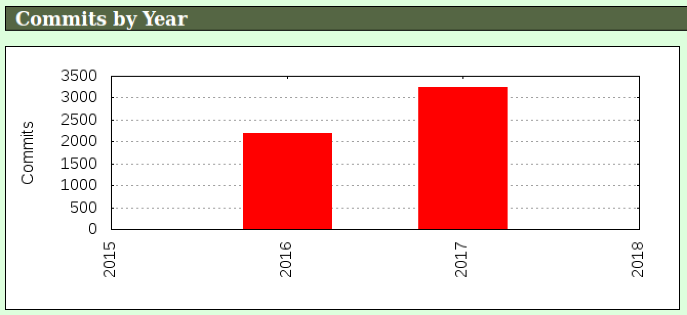
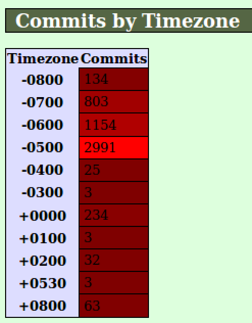

Last modified: 2017-11-28

| Author | Email(s) |
| ------ | ----- |
| Jason T Clark | jtclark@linux.vnet.ibm.com |
| Georg J. P. Link | glink@unomaha.edu |
| Matt Germonprez | germonprez@gmail.com |
| Tracy Kuhrt | tkuhrt@linuxfoundation.org |

# Introduction

As the [mission statement](https://chaoss.community/about/governance/) describes, the Linux Foundation project Community Health Analytics Open Source Software (CHAOSS) aims to _"produce integrated, open source software for analyzing software development"_, and _"establish implementation-agnostic metrics for measuring community activity, contributions, and health"_.

To achieve this goal, our community members are defining which key metrics accurately evaluate the overall health of open-source projects. These metrics will serve as the measurements monitored by the product(s) developed by the CHAOSS community. In addition to this work, the following research provides a comparative analysis of the existing tools and/or production sites that currently provide health-related metrics for open-source projects using dashboard views.

## Purpose

The purpose of this research is to provide a side-by-side comparison of the tools and community sites that reflect the health of the open-source software projects they monitor. By conducting this research, the CHAOSS community is afforded the opportunity to assess the following from each of the community health monitoring tools assesed:

- Key contribution metrics
- Components/Features available
- Ease of use/implementation

The open-source communities represented by the members of the CHAOSS project also have the opportunity to use this research as a means to determine which of these metrics, components, and features are helpful to determine community health.

# Methodology

The data collected in this report has been gathered using one or more of the following methods:

- General observation of the public facing production site
- Local installation of the software project
- Referencing the information provided in the product documentation

The method of data collection and analysis is mentioned to ensure that the reader understands the limitations of the information collected in this report. In some cases, the analysis could prove to be more accurate under more appropriate use-cases and scenarios.

## Selection of Projects

_The process of selecting which projects are included in this report ..._

# Brief Overview

Our analysis begins with a brief overview of the production sites and/or software projects researched. The information provided below introduces each tool individually and summarizes the metrics, components, usage, and implementation details.

## Production Site: [Stackalytics](http://stackalytics.com/)

The Stackalytics (OpenStack Analytics) site was developed my the Mirantis corporation in 2013 to provide OpenStack with an analytics tool that collects code contributions data, vendor drivers information, and a community members directory. As [defined by Mirantis](https://www.mirantis.com/blog/stackalytics-com-whos-growing-the-openstack-pie/), _"Stackalytics is a data visualization tool that collects data from GitHub and presents it in an array of useful forms."_

### Code Contribution Metrics

From the Stackalytics site, a number of key metrics are collected from the code contributions made by the OpenStack commmunity. They include:

- Commits
- Completed Blueprints
- Drafted Blueprints
- Emails
- Filed Bugs
- Lines of Code
- Patch Sets
- Person-day effort
- Resolved Bugs
- Reviews
- Translations

**Commits** are defined as code contributions that have

**Completed Blueprints** are

**Drafted Blueprints** are

**Emails** (as a metric) are defined as

**Filed Bugs** are

**Lines of Code** (as a metric) are

**Patch Sets** are

**Person-day effort** is metric determined by

**Resolved Bugs** are

**Reviews** are defined as

**Translations** are defined as

### Code Contribution Filters

The data provided by each of these metrics can be filtered in a number of ways. They are as follows:

- Release
- Project Type
- Module
- Company
- Contributor

The **Release** filter

The **Project Type** filter

The **Module** filter

The **Company** filter

The **Contributor** filter

### Data Visualization Examples

_TODO: ADD CHARTS AND GRAPH SNAPSHOTS HERE_

## Production Site: [OpenDaylight Spectrometer](https://spectrometer.opendaylight.org/)

This was a fork of the Stackalytics but was rewritten quite a bit.

GitHub Repo: https://github.com/opendaylight/spectrometer

_TODO: DOCUMENT OpenDaylight Spectrometer_

## Software: [Apache Kibble](https://kibble.apache.org/)

_TODO: DOCUMENT APACHE KIBBLE_

## Software: [GrimoireLab](https://grimoirelab.github.io/)
 - example: [OPNFV dashboard](https://opnfv.biterg.io)

 _TODO: DOCUMENT GRIMORIELAB_

 _TODO: DOCUMENT OPNFV EXAMPLE_

## Software: [GHData](https://github.com/OSSHealth/ghdata)

_TODO: DOCUMENT GHDATA_

## Production Site: [OpenHub](https://www.openhub.net/)

_TODO: DOCUMENT OPENHUB_

## Software: [gitstats](http://gitstats.sourceforge.net/)
`gitstats` is a statistics generator for git repositories. It examines the repository and produces statistics based on its history. Currently it produces only HTML output with tables and graphs.

`gitstats` is written in Python. The source code can be cloned from https://github.com/hoxu/gitstats. It also has packages for Fedora, Debian, and MacOS.

Both the code and the web site are licensed under GPLv2/GPLv3.

### Metrics
`gitstats` separates its metrics in the following categories:
  * General
  * Activity
  * Authors
  * Files
  * Lines
  * Tags

#### General
The general metrics that are produced by `gitstats` provide an overview of a project. These metrics are:
  * **Project Name** - the name of the project.
  * **Generated Date** - when the HTML output was generated.
  * **Generator** - the version of `gitstats` that was used to generate the metrics.
  * **Report Period** - the timeframe for which the report was generated.
  * **Age** - the age of the project (in days) and how many days have been active.
  * **Total Files** - the number of files in the project.
  * **Total Lines of Code** - the number of lines of code (number of lines added - number of lines removed).
  * **Total Commits** - the number of commits, including an average number of commits per active day and an average number of commits per lifetime of the project.
  * **Authors** - the number of authors, including an average number of commits per author.

#### Activity
  * **Weekly Activity** - the number of commits per week for the last 32 weeks.
  * **Hour of Day** - a heatmap showing the hour of the day when most activity takes place, in addition to a bar chart showing how many commits were made in a given hour.
  * **Day of Week** -  a bar chart showing the number of commits that occurred on a given day of the week.
  * **Hour of Week** - a heatmap showing the hour of the week when most activity takes place.
  * **Month of Year** - a bar chart showing the number of commits for a given month.
  * **Commits by Year/Month** - a bar chart showing the number of commits for a year/month over the lifetime of the project.
  * **Commits by Year** - a bar chart showing the number of commits for a year over the lifetime of the project.
  * **Commits by Timezone** - a heatmap showing the timezone when most activity takes place.

#### Authors
  * **List of Authors** - For the top _n_ (based on argument passed) authors, the following details are provided:
    * Author Name
    * Commit %
    * \+ Lines
    * \- Lines
    * First Commit
    * Last Commit
    * Age
    * Active Days
    * Rank by Commits
  * **Cumulated Added Lines of Code per Committer** - For top _n_ (based on argument passed) authors, provides a graph of the added lines of code over time.
  * **Commits per Author** - For top _n_ (based on argument passed) authors, provides a graph of their commits over time.
  * **Author of the Month** - For each month/year of the project, shows the author who contributed the most, including the percentage of commits and total number of authors for the month/year.
  * **Author of the Year** - For each year of the project, shows the author who contributed the most, including the percentage of commits and total number of authors for the year.
  * **Commits by Domain** - For top _m_ (based on argument passed) email domains, provides a graph showing the number of commits for particular email domain.

#### Files
  * **Total Files** - the total number of files in the project.
  * **Total Lines** - the total number of lines in the project.
  * **Average File Size** - the average number of lines in a file within the project `(total lines / total files)`.
  * **File Count by Date** - a bar chart showing the file count by date.
  * **Extensions** - a list of all file extensions that exist within the project, including the percentage of files with that extension, the percentage of lines with that extension, and the average lines per file with that extension.

#### Lines
  * **Total Lines** - the total number of lines in the project.
  * **Lines of Code** - a graph showing the lines of code over the lifetime of the project.

#### Tags
  * **Total Tags** - the total number of tags in the project.
  * **Average Commits per Tag** - the average number of commits per tag.
  * **List of Tags** - a list of tags, the date the tag was created, the number of commits for the tag, and the authors who made commits against that tag.

### Data Visualization Examples

#### General

#### Activity
##### Weekly Activity

##### Hour of Day

##### Day of Week

##### Hour of Week

##### Month of Year

##### Commits by Year/Month

##### Commits by Year

##### Commits by Timezone

#### Authors
##### List of Authors
##### Cumulated Added Lines of Code per Committer
##### Commits per Author
##### Author of the Month
##### Author of the Year
##### Commits by Domain

#### Files
##### Total Files
##### Total Lines
##### Average File Size
##### File Count by Date
##### Extensions

#### Lines
##### Total Lines
##### Lines of Code

#### Tags
##### Total Tags
##### Average Commits per Tag
##### List of Tags

# Comparative Analysis
